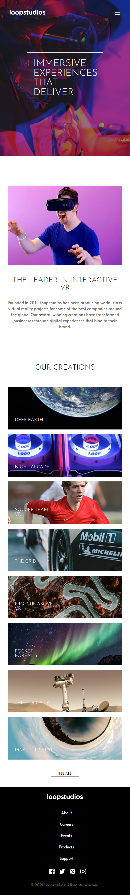
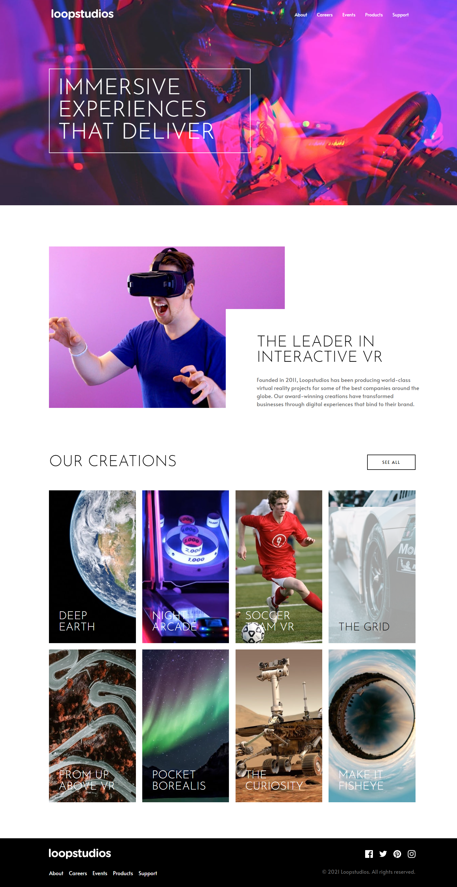

# Frontend Mentor - Loopstudios-landing-page

This is a solution to the [loopStudio-landing-page](https://www.frontendmentor.io/challenges/3column-preview-card-component-pH92eAR2-). Frontend Mentor challenges help you improve your coding skills by building realistic projects.

## Welcome! 👋

Thanks for checking out this front-end coding challenge.

## The challenge

Your challenge is to build out this product preview card component and get it looking as close to the design as possible.

You can use any tools you like to help you complete the challenge. So if you've got something you'd like to practice, feel free to give it a go.

Your users should be able to:

- View the optimal layout depending on their device's screen size
- See hover states for interactive elements

### Screenshot

### Screenshot

### Links

- Live Site URL: 

## My process

### Built with

- Semantic HTML5 markup
- CSS custom properties
- Flexbox
- Grid

## Author

- Frontend Mentor - [@z3shan7](https://www.frontendmentor.io/profile/z3shan7)